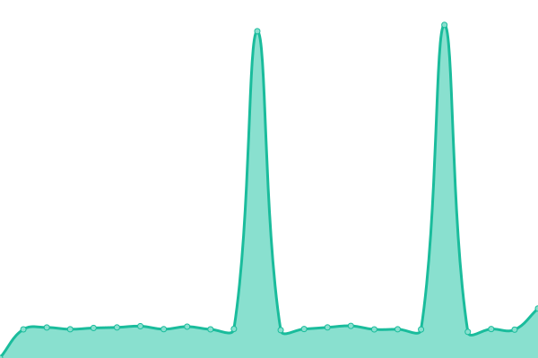
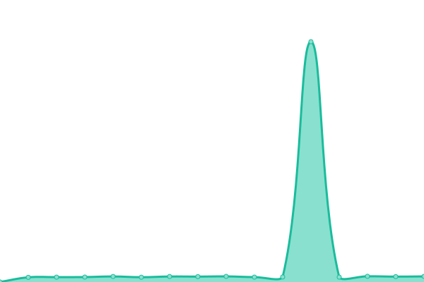
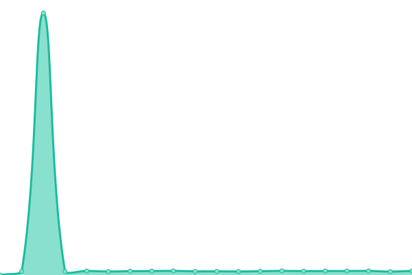

# [📈 Live Status](https://satpatisujan.github.io/icaros-uptime-qa): <!--live status--> **🟩 All systems operational**

This repository contains the open-source uptime monitor and status page for [satpatisujan](https://satpatisujan.github.io/icaros-uptime-qa), powered by [Upptime](https://github.com/upptime/upptime).

With [Upptime](https://upptime.js.org), you can get your own unlimited and free uptime monitor and status page, powered entirely by a GitHub repository. We use [Issues](https://github.com/satpatisujan/icaros-uptime-qa/issues) as incident reports, [Actions](https://github.com/satpatisujan/icaros-uptime-qa/actions) as uptime monitors, and [Pages](https://satpatisujan.github.io/icaros-uptime-qa) for the status page.

<!--start: status pages-->
<!-- This summary is generated by Upptime (https://github.com/upptime/upptime) -->
<!-- Do not edit this manually, your changes will be overwritten -->
<!-- prettier-ignore -->
| URL | Status | History | Response Time | Uptime |
| --- | ------ | ------- | ------------- | ------ |
|  [Accounts](https://qa.inframarket.cloud/accounts/ping) | 🟩 Up | [accounts.yml](https://github.com/satpatisujan/icaros-uptime-qa/commits/HEAD/history/accounts.yml) | 

 998ms
     
 | 

<a href="https://satpatisujan.github.io/icaros-uptime-qa/history/accounts">99.54%</a>
    

|  [AMS](https://qa.inframarket.cloud/ams/ping) | 🟩 Up | [ams.yml](https://github.com/satpatisujan/icaros-uptime-qa/commits/HEAD/history/ams.yml) | 

 210ms
     
 | 

<a href="https://satpatisujan.github.io/icaros-uptime-qa/history/ams">100.00%</a>
    

|  [BIS](https://qa.inframarket.cloud/bis/ping) | 🟩 Up | [bis.yml](https://github.com/satpatisujan/icaros-uptime-qa/commits/HEAD/history/bis.yml) | 

 211ms
     
 | 

<a href="https://satpatisujan.github.io/icaros-uptime-qa/history/bis">100.00%</a>
    

|  [Carts](https://qa.inframarket.cloud/carts/ping) | 🟩 Up | [carts.yml](https://github.com/satpatisujan/icaros-uptime-qa/commits/HEAD/history/carts.yml) | 

 211ms
     
 | 

<a href="https://satpatisujan.github.io/icaros-uptime-qa/history/carts">99.16%</a>
    

|  [Cheque](https://qa.inframarket.cloud/cheque/ping) | 🟩 Up | [cheque.yml](https://github.com/satpatisujan/icaros-uptime-qa/commits/HEAD/history/cheque.yml) | 

 213ms
     
 | 

<a href="https://satpatisujan.github.io/icaros-uptime-qa/history/cheque">99.36%</a>
    

|  [Communication](https://qa.inframarket.cloud/communication/ping) | 🟩 Up | [communication.yml](https://github.com/satpatisujan/icaros-uptime-qa/commits/HEAD/history/communication.yml) | 

 215ms
     
 | 

<a href="https://satpatisujan.github.io/icaros-uptime-qa/history/communication">97.68%</a>
    

|  [Coupons](https://qa.inframarket.cloud/coupons/ping) | 🟩 Up | [coupons.yml](https://github.com/satpatisujan/icaros-uptime-qa/commits/HEAD/history/coupons.yml) | 

 209ms
     
 | 

<a href="https://satpatisujan.github.io/icaros-uptime-qa/history/coupons">99.76%</a>
    

|  [Customers](https://qa.inframarket.cloud/customers/ping) | 🟩 Up | [customers.yml](https://github.com/satpatisujan/icaros-uptime-qa/commits/HEAD/history/customers.yml) | 

 210ms
     
 | 

<a href="https://satpatisujan.github.io/icaros-uptime-qa/history/customers">100.00%</a>
    

|  [Companies](https://qa.inframarket.cloud/companies/ping) | 🟩 Up | [companies.yml](https://github.com/satpatisujan/icaros-uptime-qa/commits/HEAD/history/companies.yml) | 

 211ms
     
 | 

<a href="https://satpatisujan.github.io/icaros-uptime-qa/history/companies">100.00%</a>
    

|  [DAVS](https://qa.inframarket.cloud/davs/ping) | 🟩 Up | [davs.yml](https://github.com/satpatisujan/icaros-uptime-qa/commits/HEAD/history/davs.yml) | 

 210ms
     
 | 

<a href="https://satpatisujan.github.io/icaros-uptime-qa/history/davs">100.00%</a>
    

|  [Deals](https://qa.inframarket.cloud/deals/ping) | 🟩 Up | [deals.yml](https://github.com/satpatisujan/icaros-uptime-qa/commits/HEAD/history/deals.yml) | 

 210ms
     
 | 

<a href="https://satpatisujan.github.io/icaros-uptime-qa/history/deals">99.77%</a>
    

|  [Discount](https://qa.inframarket.cloud/discount/ping) | 🟩 Up | [discount.yml](https://github.com/satpatisujan/icaros-uptime-qa/commits/HEAD/history/discount.yml) | 

 210ms
     
 | 

<a href="https://satpatisujan.github.io/icaros-uptime-qa/history/discount">99.62%</a>
    

|  [Enum Integration](https://qa.inframarket.cloud/enum-integration/ping) | 🟩 Up | [enum-integration.yml](https://github.com/satpatisujan/icaros-uptime-qa/commits/HEAD/history/enum-integration.yml) | 

 210ms
     
 | 

<a href="https://satpatisujan.github.io/icaros-uptime-qa/history/enum-integration">100.00%</a>
    

|  [ERP Integration](https://qa.inframarket.cloud/erp-integration/ping) | 🟩 Up | [erp-integration.yml](https://github.com/satpatisujan/icaros-uptime-qa/commits/HEAD/history/erp-integration.yml) | 

 211ms
     
 | 

<a href="https://satpatisujan.github.io/icaros-uptime-qa/history/erp-integration">100.00%</a>
    

|  [Fulfilment](https://qa.inframarket.cloud/fulfilment/ping) | 🟩 Up | [fulfilment.yml](https://github.com/satpatisujan/icaros-uptime-qa/commits/HEAD/history/fulfilment.yml) | 

 210ms
     
 | 

<a href="https://satpatisujan.github.io/icaros-uptime-qa/history/fulfilment">100.00%</a>
    

|  [Identity](https://qa.inframarket.cloud/identity/ping) | 🟩 Up | [identity.yml](https://github.com/satpatisujan/icaros-uptime-qa/commits/HEAD/history/identity.yml) | 

 211ms
     
 | 

<a href="https://satpatisujan.github.io/icaros-uptime-qa/history/identity">100.00%</a>
    

|  [Influencers](https://qa.inframarket.cloud/influencers/ping) | 🟩 Up | [influencers.yml](https://github.com/satpatisujan/icaros-uptime-qa/commits/HEAD/history/influencers.yml) | 

 212ms
     
 | 

<a href="https://satpatisujan.github.io/icaros-uptime-qa/history/influencers">100.00%</a>
    

|  [Inventory](https://qa.inframarket.cloud/inventory/ping) | 🟩 Up | [inventory.yml](https://github.com/satpatisujan/icaros-uptime-qa/commits/HEAD/history/inventory.yml) | 

 210ms
     
 | 

<a href="https://satpatisujan.github.io/icaros-uptime-qa/history/inventory">100.00%</a>
    

|  [Invoices](https://qa.inframarket.cloud/invoices/ping) | 🟩 Up | [invoices.yml](https://github.com/satpatisujan/icaros-uptime-qa/commits/HEAD/history/invoices.yml) | 

 211ms
     
 | 

<a href="https://satpatisujan.github.io/icaros-uptime-qa/history/invoices">99.85%</a>
    

|  [KMS](https://qa.inframarket.cloud/kms/ping) | 🟩 Up | [kms.yml](https://github.com/satpatisujan/icaros-uptime-qa/commits/HEAD/history/kms.yml) | 

 211ms
     
 | 

<a href="https://satpatisujan.github.io/icaros-uptime-qa/history/kms">100.00%</a>
    

|  [KYCs](https://qa.inframarket.cloud/kycs/ping) | 🟩 Up | [ky-cs.yml](https://github.com/satpatisujan/icaros-uptime-qa/commits/HEAD/history/ky-cs.yml) | 

 209ms
     
 | 

<a href="https://satpatisujan.github.io/icaros-uptime-qa/history/ky-cs">99.62%</a>
    

|  [Lead](https://qa.inframarket.cloud/lead/ping) | 🟩 Up | [lead.yml](https://github.com/satpatisujan/icaros-uptime-qa/commits/HEAD/history/lead.yml) | 

 210ms
     
 | 

<a href="https://satpatisujan.github.io/icaros-uptime-qa/history/lead">100.00%</a>
    

|  [Location](https://qa.inframarket.cloud/location/ping) | 🟩 Up | [location.yml](https://github.com/satpatisujan/icaros-uptime-qa/commits/HEAD/history/location.yml) | 

 209ms
     
 | 

<a href="https://satpatisujan.github.io/icaros-uptime-qa/history/location">100.00%</a>
    

|  [Loyalty Orchestration](https://qa.inframarket.cloud/loyalty-orchestration/ping) | 🟩 Up | [loyalty-orchestration.yml](https://github.com/satpatisujan/icaros-uptime-qa/commits/HEAD/history/loyalty-orchestration.yml) | 

 211ms
     
 | 

<a href="https://satpatisujan.github.io/icaros-uptime-qa/history/loyalty-orchestration">99.77%</a>
    

|  [Loyalty](https://qa.inframarket.cloud/loyalty/ping) | 🟩 Up | [loyalty.yml](https://github.com/satpatisujan/icaros-uptime-qa/commits/HEAD/history/loyalty.yml) | 

 214ms
     
 | 

<a href="https://satpatisujan.github.io/icaros-uptime-qa/history/loyalty">98.75%</a>
    

|  [OMS](https://qa.inframarket.cloud/oms/ping) | 🟩 Up | [oms.yml](https://github.com/satpatisujan/icaros-uptime-qa/commits/HEAD/history/oms.yml) | 

 211ms
     
 | 

<a href="https://satpatisujan.github.io/icaros-uptime-qa/history/oms">80.34%</a>
    

|  [Orders](https://qa.inframarket.cloud/orders/ping) | 🟩 Up | [orders.yml](https://github.com/satpatisujan/icaros-uptime-qa/commits/HEAD/history/orders.yml) | 

 211ms
     
 | 

<a href="https://satpatisujan.github.io/icaros-uptime-qa/history/orders">100.00%</a>
    

|  [Payments](https://qa.inframarket.cloud/payments/ping) | 🟩 Up | [payments.yml](https://github.com/satpatisujan/icaros-uptime-qa/commits/HEAD/history/payments.yml) | 

 211ms
     
 | 

<a href="https://satpatisujan.github.io/icaros-uptime-qa/history/payments">100.00%</a>
    

|  [PIS](https://qa.inframarket.cloud/pis/ping) | 🟩 Up | [pis.yml](https://github.com/satpatisujan/icaros-uptime-qa/commits/HEAD/history/pis.yml) | 

 212ms
     
 | 

<a href="https://satpatisujan.github.io/icaros-uptime-qa/history/pis">99.77%</a>
    

|  [Payout](https://qa.inframarket.cloud/payout/ping) | 🟩 Up | [payout.yml](https://github.com/satpatisujan/icaros-uptime-qa/commits/HEAD/history/payout.yml) | 

 211ms
     
 | 

<a href="https://satpatisujan.github.io/icaros-uptime-qa/history/payout">99.85%</a>
    

|  [PN Customers](https://qa.inframarket.cloud/pn/customers/ping) | 🟩 Up | [pn-customers.yml](https://github.com/satpatisujan/icaros-uptime-qa/commits/HEAD/history/pn-customers.yml) | 

 210ms
     
 | 

<a href="https://satpatisujan.github.io/icaros-uptime-qa/history/pn-customers">100.00%</a>
    

|  [Pricing](https://qa.inframarket.cloud/pricing/ping) | 🟩 Up | [pricing.yml](https://github.com/satpatisujan/icaros-uptime-qa/commits/HEAD/history/pricing.yml) | 

 210ms
     
 | 

<a href="https://satpatisujan.github.io/icaros-uptime-qa/history/pricing">100.00%</a>
    

|  [Products](https://qa.inframarket.cloud/products/ping) | 🟩 Up | [products.yml](https://github.com/satpatisujan/icaros-uptime-qa/commits/HEAD/history/products.yml) | 

 212ms
     
 | 

<a href="https://satpatisujan.github.io/icaros-uptime-qa/history/products">99.36%</a>
    

|  [Quotations](https://qa.inframarket.cloud/quotations/ping) | 🟩 Up | [quotations.yml](https://github.com/satpatisujan/icaros-uptime-qa/commits/HEAD/history/quotations.yml) | 

 211ms
     
 | 

<a href="https://satpatisujan.github.io/icaros-uptime-qa/history/quotations">100.00%</a>
    

|  [Search](https://qa.inframarket.cloud/search/ping) | 🟩 Up | [search.yml](https://github.com/satpatisujan/icaros-uptime-qa/commits/HEAD/history/search.yml) | 

 213ms
     
 | 

<a href="https://satpatisujan.github.io/icaros-uptime-qa/history/search">99.36%</a>
    

|  [Search Sync](https://qa.inframarket.cloud/search-sync/ping) | 🟩 Up | [search-sync.yml](https://github.com/satpatisujan/icaros-uptime-qa/commits/HEAD/history/search-sync.yml) | 

 211ms
     
 | 

<a href="https://satpatisujan.github.io/icaros-uptime-qa/history/search-sync">100.00%</a>
    

|  [Serviceability](https://qa.inframarket.cloud/serviceability/ping) | 🟩 Up | [serviceability.yml](https://github.com/satpatisujan/icaros-uptime-qa/commits/HEAD/history/serviceability.yml) | 

 210ms
     
 | 

<a href="https://satpatisujan.github.io/icaros-uptime-qa/history/serviceability">100.00%</a>
    

|  [Stores](https://qa.inframarket.cloud/stores/ping) | 🟩 Up | [stores.yml](https://github.com/satpatisujan/icaros-uptime-qa/commits/HEAD/history/stores.yml) | 

 211ms
     
 | 

<a href="https://satpatisujan.github.io/icaros-uptime-qa/history/stores">100.00%</a>
    

|  [Suppliers](https://qa.inframarket.cloud/suppliers/ping) | 🟩 Up | [suppliers.yml](https://github.com/satpatisujan/icaros-uptime-qa/commits/HEAD/history/suppliers.yml) | 

 211ms
     
 | 

<a href="https://satpatisujan.github.io/icaros-uptime-qa/history/suppliers">100.00%</a>
    

|  [TallyI](https://qa.inframarket.cloud/tallyi/ping) | 🟩 Up | [tally-i.yml](https://github.com/satpatisujan/icaros-uptime-qa/commits/HEAD/history/tally-i.yml) | 

 211ms
     
 | 

<a href="https://satpatisujan.github.io/icaros-uptime-qa/history/tally-i">100.00%</a>
    

|  [Task](https://qa.inframarket.cloud/task/ping) | 🟩 Up | [task.yml](https://github.com/satpatisujan/icaros-uptime-qa/commits/HEAD/history/task.yml) | 

 210ms
     
 | 

<a href="https://satpatisujan.github.io/icaros-uptime-qa/history/task">99.85%</a>
    

|  [Tax](https://qa.inframarket.cloud/tax/ping) | 🟩 Up | [tax.yml](https://github.com/satpatisujan/icaros-uptime-qa/commits/HEAD/history/tax.yml) | 

 210ms
     
 | 

<a href="https://satpatisujan.github.io/icaros-uptime-qa/history/tax">100.00%</a>
    

|  [Tickets](https://qa.inframarket.cloud/tickets/ping) | 🟩 Up | [tickets.yml](https://github.com/satpatisujan/icaros-uptime-qa/commits/HEAD/history/tickets.yml) | 

 211ms
     
 | 

<a href="https://satpatisujan.github.io/icaros-uptime-qa/history/tickets">100.00%</a>
    

|  [Trips](https://qa.inframarket.cloud/trips/ping) | 🟩 Up | [trips.yml](https://github.com/satpatisujan/icaros-uptime-qa/commits/HEAD/history/trips.yml) | 

 210ms
     
 | 

<a href="https://satpatisujan.github.io/icaros-uptime-qa/history/trips">100.00%</a>
    

|  [Users](https://qa.inframarket.cloud/users/ping) | 🟩 Up | [users.yml](https://github.com/satpatisujan/icaros-uptime-qa/commits/HEAD/history/users.yml) | 

 212ms
     
 | 

<a href="https://satpatisujan.github.io/icaros-uptime-qa/history/users">99.36%</a>
    

|  [Vehicles](https://qa.inframarket.cloud/vehicles/ping) | 🟩 Up | [vehicles.yml](https://github.com/satpatisujan/icaros-uptime-qa/commits/HEAD/history/vehicles.yml) | 

 210ms
     
 | 

<a href="https://satpatisujan.github.io/icaros-uptime-qa/history/vehicles">100.00%</a>
    

|  [Visit](https://qa.inframarket.cloud/visit/ping) | 🟩 Up | [visit.yml](https://github.com/satpatisujan/icaros-uptime-qa/commits/HEAD/history/visit.yml) | 

 210ms
     
 | 

<a href="https://satpatisujan.github.io/icaros-uptime-qa/history/visit">100.00%</a>
    

<!--end: status pages-->

[**Visit our status website →**](https://satpatisujan.github.io/icaros-uptime-qa)

## 📄 License

- Powered by: [Upptime](https://github.com/upptime/upptime)
- Code: [MIT](./LICENSE) © [Anand Chowdhary](https://anandchowdhary.com), supported by [Pabio](https://pabio.com)
- Data in the `./history` directory: [Open Database License](https://opendatacommons.org/licenses/odbl/1-0/)
